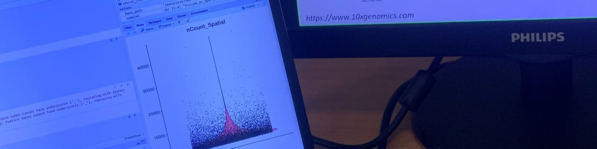

## Hii, I'm Ares! 

---

I am a bioinformatician with experience in neuroscience and oncology research. I work with a variety of omics datasets and enjoy developing reproducible analytical pipelines and extracting meaningful insights from complex biological data.

- Interests: single-cell analysis, spatial transcriptomics, machine learning applications in biomedicine.
- Looking for opportunities in: bioinformatics, omics analysis or data science.

---

#### **Programming & Scripting**

#### **Bioinformatics**

#### **Tools**

#### **Visualisation**

